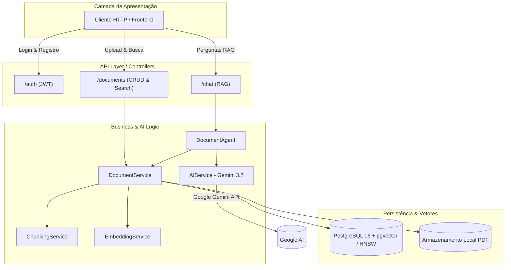
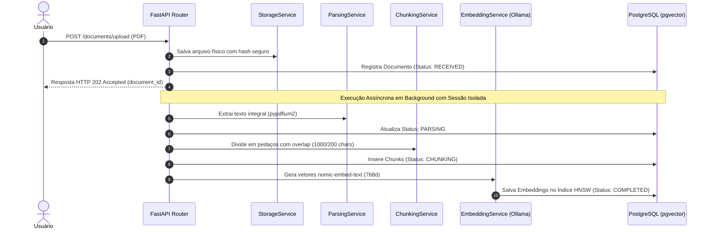
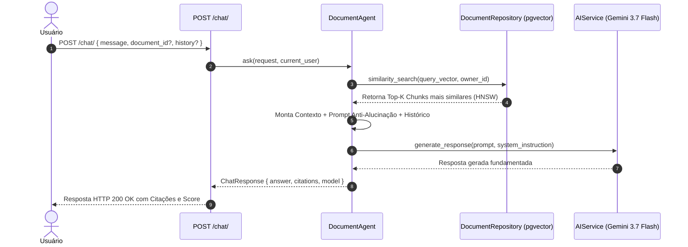

# 📄 Document AI Platform (Plataforma IA para Documentos)

Uma API robusta, moderna e escalável desenvolvida com **FastAPI**, **PostgreSQL 16 + pgvector (Índice HNSW)** e **Google Gemini 3.7 Flash** para gestão inteligente de documentos, busca semântica vetorial e chat conversacional com **RAG (*Retrieval-Augmented Generation*)**.

Este projeto serve como um showcase de engenharia de software avançada, aplicando arquitetura em camadas (**Clean Architecture**), injeção de dependências, processamento assíncrono em background, isolamento estrito de dados (*multi-tenancy*) e suíte abrangente de testes automatizados.

---

## 🚀 Tecnologias Utilizadas

- **Web Framework**: [FastAPI](https://fastapi.tiangolo.com/) (Assíncrono, moderno e baseado em type hints)
- **Generative AI & LLM**: [Google Gemini 3.7 Flash](https://ai.google.dev/) via SDK oficial `google-genai` (Raciocínio avançado, síntese de documentos e respostas fundamentadas)
- **Database & Vector Search**: [PostgreSQL 16](https://www.postgresql.org/) + [pgvector](https://github.com/pgvector/pgvector) com indexação **HNSW** (`vector_cosine_ops`, 768 dimensões)
- **Database ORM**: [SQLAlchemy 2.0](https://www.sqlalchemy.org/) (Mapeamento declarativo moderno com `Mapped` e `mapped_column`)
- **Local Embeddings**: [Ollama](https://ollama.com/) executando o modelo `nomic-embed-text` (768d) via [LlamaIndex](https://www.llamaindex.ai/)
- **PDF Extraction**: `pypdfium2` para extração veloz de texto
- **Security & Auth**: [pwdlib](https://pwdlib.readthedocs.io/) + [Argon2id](https://en.wikipedia.org/wiki/Argon2) (Hashing recomendado pela OWASP) e [PyJWT](https://pyjwt.readthedocs.io/) (Autenticação via Bearer Tokens)
- **Validation**: [Pydantic v2](https://docs.pydantic.dev/) & `pydantic-settings`
- **Containerization**: [Docker](https://www.docker.com/) & [Docker Compose](https://docs.docker.com/compose/)
- **Tests**: [Pytest](https://docs.pytest.org/) com fixtures isoladas e mocks

---

## 🏛️ Arquitetura e Pipelines do Sistema

A aplicação segue rigorosamente o padrão de separação de responsabilidades em camadas:
$$\text{Routes (API)} \longrightarrow \text{Agents / Services (Regras de Negócio)} \longrightarrow \text{Repositories (Persistência)} \longrightarrow \text{Models (Banco)}$$



---

### 🔄 1. Pipeline Assíncrono de Ingestão de Documentos

Ao enviar um PDF, a API responde imediatamente com `202 Accepted` e orquestra o processamento completo em segundo plano com sessão de banco dedicada:



---

### 💬 2. Pipeline de RAG e Chat Conversacional (Gemini 3.7 Flash)

Ao receber uma pergunta, o sistema recupera os trechos mais relevantes por similaridade de cosseno e sintetiza a resposta final com citações estruturadas:



---

## 📂 Estrutura de Diretórios

```bash
backend/
├── app/
│   ├── main.py                     # Bootstrap da aplicação, lifespan e registro de rotas
│   ├── agents/
│   │   └── document_agent.py       # Orquestrador RAG (Prompt Engineering + Gemini 3.7)
│   ├── api/
│   │   ├── routes_auth.py          # Autenticação, Login OAuth2 e JWT
│   │   ├── routes_users.py         # Cadastro e perfil de usuários
│   │   ├── routes_documents.py     # Upload, CRUD e Busca Semântica (/search)
│   │   └── routes_chat.py          # Chat conversacional com RAG (/chat)
│   ├── core/
│   │   ├── config.py               # Configurações com Pydantic Settings
│   │   └── security.py             # Hash Argon2id e assinatura/validação JWT
│   ├── database/
│   │   ├── base.py                 # SQLAlchemy Declarative Base
│   │   ├── connection.py           # Engine e SessionLocal do PostgreSQL
│   │   ├── dependencies.py         # Injeção de dependências (get_db, get_current_user, etc.)
│   │   └── models/
│   │       ├── user.py             # Entidade User
│   │       ├── document.py         # Entidade Document e enum DocumentStatus
│   │       └── document_chunk.py   # Entidade DocumentChunk com coluna Vector(768) e Índice HNSW
│   ├── repositories/
│   │   ├── user_repository.py      # Persistência de usuários
│   │   └── document_repository.py  # Persistência de documentos e busca vetorial por cosseno
│   ├── schemas/
│   │   ├── user_schema.py          # DTOs de usuário e registro
│   │   ├── document_schema.py      # DTOs de documentos, upload e busca semântica
│   │   └── chat_schema.py          # DTOs de mensagens, citações e respostas de chat
│   ├── services/
│   │   ├── user_service.py         # Regras de negócio de usuário
│   │   ├── document_service.py     # Orquestrador de upload, busca e ciclo de vida
│   │   ├── storage_service.py      # Gestão segura de arquivos em disco
│   │   ├── parsing_service.py      # Extração de texto de PDF (pypdfium2)
│   │   ├── chunking_service.py     # Segmentação por janela deslizante com preservação de cauda
│   │   ├── embedding_service.py    # Geração de embeddings com Ollama (nomic-embed-text)
│   │   └── ai_service.py           # Integração com Google Gemini 3.7 Flash SDK
│   └── tests/                      # Suíte de testes automatizados (Pytest)
├── dockerfile                      # Imagem Python 3.13-slim otimizada
├── docker-compose.yml              # Stack de desenvolvimento (API, pgvector, Ollama)
├── docker-compose.test.yml         # Container isolado para suíte de testes
└── pytest.ini                      # Configuração do Pytest
```

---

## 📡 Catálogo de Endpoints da API

| Método | Rota | Descrição | Autenticação |
| :--- | :--- | :--- | :---: |
| `POST` | `/auth/login` | Autentica usuário e retorna Bearer Token JWT | Pública |
| `GET` | `/auth/me` | Retorna os dados do usuário autenticado | Bearer JWT |
| `POST` | `/users/register` | Cadastra novo usuário com hash Argon2id | Pública |
| `POST` | `/documents/upload` | Upload assíncrono de PDF (retorna `202 Accepted`) | Bearer JWT |
| `POST` | `/documents/` | Criação manual de documento via schema | Bearer JWT |
| `GET` | `/documents/` | Lista todos os documentos do usuário | Bearer JWT |
| `GET` | `/documents/{id}` | Recupera metadados e status de um documento | Bearer JWT |
| `DELETE` | `/documents/{id}` | Remove documento do banco e arquivo físico | Bearer JWT |
| `POST` | `/documents/search` | **Busca semântica** vetorial nos chunks (HNSW) | Bearer JWT |
| `POST` | `/chat/` | **RAG Chat** conversacional com Gemini 3.7 Flash e citações | Bearer JWT |

---

## ⚙️ Execução e Configuração

### 1. Configuração de Variáveis de Ambiente
Copie o template seguro `.env.example` para `.env` e preencha sua chave do Google Gemini:

```bash
cp .env.example .env
```

Edite o `.env`:
```env
POSTGRES_USER=admin
POSTGRES_PASSWORD=admin
POSTGRES_DB=documents
POSTGRES_HOST=database
POSTGRES_PORT=5432
JWT_SECRET_KEY=sua_chave_secreta_jwt_longa_e_aleatoria
JWT_ALGORITHM=HS256
ACCESS_TOKEN_EXPIRE_MINUTES=30
OLLAMA_BASE_URL=http://localhost:11434
OLLAMA_EMBED_MODEL=nomic-embed-text
OLLAMA_LLM_MODEL=qwen2.5:7b

# Google Gemini API
GOOGLE_API_KEY=sua_chave_do_google_ai_studio_aqui
GEMINI_MODEL=gemini-3.7-flash
```

> 🛡️ **Segurança**: O `.gitignore` possui regras estritas para bloquear qualquer variante `.env*`, garantindo que chaves privadas nunca sejam enviadas para o Git.

### 2. Subindo a Stack Completa com Docker

```bash
docker compose up -d --build
```

- **API Swagger / OpenAPI**: `http://localhost:8000/docs`
- **API Redoc**: `http://localhost:8000/redoc`
- **Ollama API**: `http://localhost:11434`

---

## 🧪 Testes Automatizados

A suíte de testes cobre regras de negócio, serviços, repositórios, parsing, chunking, geração de IA e busca semântica:

```bash
# Executar todos os testes unitários
pytest
```

---

## 📊 RAG Evaluation & Observabilidade

A plataforma conta com um sistema de avaliação quantitativa e observabilidade contínua de RAG baseado em execuções reais, com dataset versionável e zero dados simulados.

### Métricas Implementadas:
1. **RAG Quality**:
   - **Recall@5**: Proporção de trechos factuais essenciais recuperados no Top-5.
   - **MRR@5 (Mean Reciprocal Rank)**: $1 / \text{posição do 1º chunk relevante}$.
   - **Faithfulness**: Avaliação factual com decomposição de afirmações atômicas e validação booleana estrita contra o contexto.
   - **Answer Relevancy**: Verificação de aderência direta da resposta à pergunta do usuário.
2. **Performance & Latências Reais**:
   - Percentis **P50**, **P95**, **P99** e Média Real calculados estatisticamente sobre $N$ amostras.
   - Breakdown de latência: Retrieval Time e LLM Generation Time.
3. **Reliability & Confiabilidade**:
   - **Success Rate**, **Error Rate** (com categorização de falhas) e **Empty Retrieval Rate**.

### Como Executar a Avaliação via CLI:
```bash
# Executa a bateria de avaliação e salva o relatório
python -m app.evaluation.runner --dataset backend/app/evaluation/datasets/contracts_eval_v1.json --name "Experimento A" --top_k 5

# Para definir uma execução como Baseline oficial:
python -m app.evaluation.runner --baseline --name "Baseline Oficial v1.0"
```

Acesse o painel interativo no frontend: **`http://localhost:3001/evaluation`**.

---

## 🔒 Boas Práticas e Segurança Aplicadas

- **Isolamento Multi-Tenant**: Todas as operações de leitura, deleção, busca vetorial e chat aplicam filtro explícito por `owner_id == current_user.id` no banco de dados.
- **Evidence-First Architecture**: Citações canônicas indexadas diretamente ao texto original de custódia.

- **Índice Vetorial HNSW**: Indexação de alta velocidade $O(\log N)$ para recuperação de embeddings de 768 dimensões com métrica de distância de cosseno.
- **Proteção Anti-Alucinação**: Prompts de sistema rigorosos instruindo o Gemini 3.7 Flash a responder estritamente baseado nas fontes recuperadas, indicando ausência de contexto quando aplicável.
- **Sessão Isolada em Background**: Background tasks gerenciam sua própria sessão de banco de dados (`SessionLocal`), prevenindo vazamento de conexões.
- **Armazenamento Seguro de Arquivos**: Os arquivos recebem nomes únicos (`UUID4.pdf`), com verificação de caminho para prevenção de ataques de *Path Traversal*.