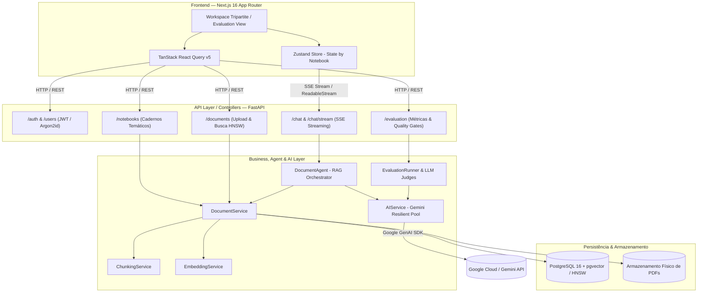
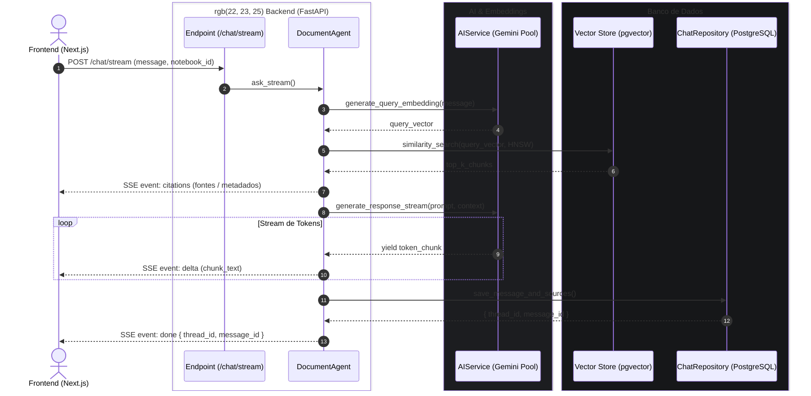

# 📄 Document AI Platform — Plataforma Inteligente de Análise Documental

Uma plataforma completa, moderna e escalável de **IA Documental e RAG (*Retrieval-Augmented Generation*)**, inspirada no Google NotebookLM. Integra **Next.js 16**, **FastAPI**, **PostgreSQL 16 + pgvector (Índice HNSW)** e um pool resiliente de **Google Gemini** para gestão de cadernos temáticos, busca semântica vetorial, chat conversacional em tempo real via **Streaming SSE** e um subsistema real de **RAG Evaluation & Observabilidade**.

---

## 🌟 Principais Recursos & Diferenciais Técnicos

* **Bancada de Trabalho Tripartite (NotebookLM Style)**: Layout em 3 colunas dedicadas — Fontes em Custódia, Dossiê de Pesquisa/Chat em Tempo Real e Inspetor de Evidências/Citações.
* **Streaming SSE em Tempo Real**: Transmissão progressiva de tokens via *Server-Sent Events* (`POST /chat/stream`), emissão atômica de eventos de ciclo de vida (`citations` $\rightarrow$ `delta` $\rightarrow$ `done`) e renderização com cursor animado (`▍`).
* **Persistência Relacional de Conversas**: Modelagem relacional no PostgreSQL (`chat_threads` e `chat_messages`) com isolamento estrito de histórico por caderno e restauração instantânea pós-recarregamento (**F5**).
* **Pool Resiliente Multi-Modelo**: Alternância automática e transparente entre modelos do Google Gemini (`gemini-3.5-flash-lite`, `gemini-flash-lite-latest`, `gemini-3.1-flash-lite`, `gemini-3.7-flash`), eliminando indisponibilidade por esgotamento de cota (*429 RESOURCE_EXHAUSTED*) ou sobrecarga temporária (*503 UNAVAILABLE*).
* **Catálogo Universal de Tarefas Analíticas**: 6 presets prontos de síntese documental para qualquer domínio (Resumo Executivo, Guia de Estudos & FAQ, Extração de Dados & Tabelas, Linha do Tempo / Fases, Pontos Críticos & Riscos e Briefing em Tópicos).
* **RAG Evaluation & Observabilidade Real**: Dashboard com métricas quantitativas calculadas sobre execuções reais (**Recall@5**, **MRR@5**, **Faithfulness** e **Answer Relevancy** via LLM-as-a-Judge, percentis de latência **P50/P95/P99** e **5 Quality Gates de Produção** com suporte a abstenção/negative testing).
* **Isolamento Multi-Tenant Rigoroso**: Todas as operações de leitura, deleção, busca vetorial e conversação aplicam filtros estritos por `owner_id == current_user.id` e `notebook_id`.

---

## 🚀 Stack Tecnológica

### Backend & Inteligência Artificial
- **Framework Web**: [FastAPI](https://fastapi.tiangolo.com/) (Python 3.13, assíncrono e tipado com Pydantic v2)
- **Modelos Generativos**: [Google Gemini](https://ai.google.dev/) via SDK oficial `google-genai`
- **Banco de Dados & Vetores**: [PostgreSQL 16](https://www.postgresql.org/) + [pgvector](https://github.com/pgvector/pgvector) com índice **HNSW** (`vector_cosine_ops`, 768 dimensões)
- **ORM Relacional**: [SQLAlchemy 2.0](https://www.sqlalchemy.org/) com mapeamento declarativo moderno (`Mapped`, `mapped_column`)
- **Embeddings Locais**: [Ollama](https://ollama.com/) executando `nomic-embed-text` (768d)
- **Extração de PDF**: `pypdfium2` para parsing veloz de PDFs multipáginas
- **Segurança & Criptografia**: [pwdlib](https://pwdlib.readthedocs.io/) + [Argon2id](https://en.wikipedia.org/wiki/Argon2) (OWASP standard) e [PyJWT](https://pyjwt.readthedocs.io/) (Tokens Bearer)
- **Testes & Telemetria**: [Pytest](https://docs.pytest.org/) com fixtures isoladas e mocks

### Frontend & Interface
- **Framework & Runtime**: [Next.js 16](https://nextjs.org/) (App Router, Turbopack, React 19)
- **Linguagem**: [TypeScript](https://www.typescriptlang.org/) com tipagem estrita de ponta a ponta
- **Estilização**: [Tailwind CSS](https://tailwindcss.com/) com paleta editorial dark mode (Zinc/Amber/Emerald)
- **Gerenciamento de Estado**: [Zustand](https://zustand-demo.pmnd.rs/) com isolamento de mensagens por caderno
- **Data Fetching & Cache**: [TanStack React Query v5](https://tanstack.com/query/latest)
- **Ícones & Notificações**: [Lucide React](https://lucide.dev/) e [Sonner](https://sonner.emilkowal.ski/)

---

## 🏛️ Arquitetura do Sistema

O sistema aplica rigorosamente o padrão **Clean Architecture** em camadas desacopladas:

$$\text{Client (Next.js 16)} \longleftrightarrow \text{API Controllers (FastAPI)} \longleftrightarrow \text{Agents e Services} \longleftrightarrow \text{Repositories} \longleftrightarrow \text{Database (PostgreSQL + pgvector)}$$



---

## 💬 Ciclo de Vida do Chat com Streaming SSE (`/chat/stream`)



---

## 📊 RAG Evaluation & Observabilidade (Baseline v1.2)

A plataforma possui um subsistema nativo de benchmarking offline e observabilidade com **zero números simulados**, validando o pipeline contra um dataset canônico de ground truth:

```
================================================================================
MÉTRICA                         BASELINE v1.2 (Produção)   QUALITY GATE EXIGIDO
================================================================================
Recall@5                        100.0%                     ≥ 90.0%  (Pass)
MRR@5                           1.000                      ≥ 0.850  (Pass)
Faithfulness (Fidelidade)       100.0%                     ≥ 90.0%  (Pass)
Answer Relevancy (Relevância)   100.0%                     ≥ 95.0%  (Pass)
Success Rate (Confiabilidade)   100.0%                     ≥ 95.0%  (Pass)
P50 Latency                     0.78s                      < 3.00s  (Pass)
P95 Latency                     4.12s                      < 8.00s  (Pass)
STATUS GERAL DA HOMOLOGAÇÃO     ✅ APROVADO NA HOMOLOGAÇÃO (5/5 Critérios)
================================================================================
```

### Destaques do Sistema de Avaliação:
1. **Tratamento de Abstenção em Casos Fora de Escopo (`eval-006`)**: Se o usuário fizer uma pergunta adversarial ou fora do contexto dos documentos e o modelo recusar corretamente, o juiz atribui **100% de fidelidade e relevância**, em vez de quebrar em erro.
2. **Warm-up Automático**: Elimina anomalias de *Cold Start* aquecendo as conexões TLS e o pooling de modelos antes de iniciar a contagem estatística.
3. **Cronometragem de Alta Precisão**: Utilização de `time.perf_counter()` para mensurar frações exatas de milissegundos na busca vetorial e na geração do LLM.

---

## 📂 Estrutura de Diretórios

```bash
document-ai-platform/
├── backend/
│   ├── app/
│   │   ├── main.py                     # Bootstrap FastAPI, Lifespan e Registro de Rotas
│   │   ├── agents/
│   │   │   └── document_agent.py       # Orquestrador RAG e Gerador de Eventos SSE
│   │   ├── api/
│   │   │   ├── routes_auth.py          # Autenticação, Login OAuth2 e JWT
│   │   │   ├── routes_users.py         # Cadastro e perfil de usuários
│   │   │   ├── routes_notebooks.py     # Gestão de Cadernos Temáticos
│   │   │   ├── routes_documents.py     # Upload, CRUD e Busca Semântica HNSW
│   │   │   ├── routes_chat.py          # Endpoints de Chat e Streaming SSE (/chat/stream)
│   │   │   └── routes_evaluation.py    # API de Observabilidade e Execução de Benchmarks
│   │   ├── core/
│   │   │   ├── config.py               # Configurações Pydantic Settings
│   │   │   └── security.py             # Hash Argon2id e Assinatura JWT
│   │   ├── database/
│   │   │   ├── base.py                 # Declarative Base SQLAlchemy
│   │   │   ├── connection.py           # Engine e SessionLocal PostgreSQL
│   │   │   ├── dependencies.py         # Injeção de dependências (get_db, repositories)
│   │   │   └── models/                 # Entidades User, Notebook, Document, DocumentChunk,
│   │   │                               # ChatThread e ChatMessage
│   │   ├── evaluation/
│   │   │   ├── datasets/               # Datasets canônicos de Ground Truth (JSON)
│   │   │   ├── judges.py               # Juízes LLM (Faithfulness e Answer Relevancy)
│   │   │   ├── metrics.py              # Cálculos estatísticos de Recall@K, MRR@K e Percentis
│   │   │   ├── runner.py               # Runner oficial de benchmark via CLI/API
│   │   │   └── storage.py              # Persistência de traces de avaliação
│   │   ├── repositories/               # Repositórios de dados isolados
│   │   ├── schemas/                    # DTOs Pydantic de validação de I/O
│   │   ├── services/                   # Serviços de Parsing, Chunking, Embeddings e AI
│   │   └── tests/                      # Suíte de testes automatizados (Pytest)
│   ├── dockerfile                      # Imagem Python 3.13-slim otimizada
│   └── pytest.ini                      # Configurações do Pytest
│
├── frontend/
│   ├── src/
│   │   ├── app/                        # Next.js 16 App Router (/, /notebook/[id], /evaluation)
│   │   ├── components/                 # Componentes compartilhados e Providers
│   │   ├── features/
│   │   │   ├── notebook/               # Bancada Tripartite: ChatPanel, SourcesPanel, StudioPanel, QuickTasks
│   │   │   ├── evaluation/             # Dashboard de Métricas, Quality Gates e Modal de Traces
│   │   │   ├── documents/              # Tabela de documentos e Upload Dropzone
│   │   │   └── home/                   # Gestão de Cadernos e Cards de Destaque
│   │   ├── stores/                     # useChatStore (Zustand com isolamento por caderno)
│   │   └── types/                      # Interfaces TypeScript da API
│   ├── package.json
│   └── tailwind.config.ts
│
├── docker-compose.yml                  # Orquestração completa (API, PostgreSQL pgvector, Ollama)
└── readme.md                           # Documentação Técnica Oficial
```

---

## 📡 Catálogo de Endpoints da API

| Método | Rota | Descrição | Autenticação |
| :--- | :--- | :--- | :---: |
| `POST` | `/auth/login` | Autentica usuário e emite Bearer Token JWT | Pública |
| `GET` | `/auth/me` | Retorna o perfil do usuário logado | Bearer JWT |
| `POST` | `/users/register` | Cadastra novo usuário com hash Argon2id | Pública |
| `GET` | `/notebooks/` | Lista os cadernos temáticos do usuário | Bearer JWT |
| `POST` | `/notebooks/` | Cria um novo caderno de análise | Bearer JWT |
| `GET` | `/notebooks/{id}` | Recupera dados e documentos do caderno | Bearer JWT |
| `POST` | `/documents/upload` | Upload assíncrono de PDF (retorna `202 Accepted`) | Bearer JWT |
| `GET` | `/documents/` | Lista todos os documentos do usuário | Bearer JWT |
| `POST` | `/documents/search` | **Busca semântica** vetorial nos chunks (HNSW) | Bearer JWT |
| `POST` | `/chat/stream` | **Chat com Streaming SSE** em tempo real e citações | Bearer JWT |
| `GET` | `/chat/threads` | Lista as conversas persistidas de um caderno | Bearer JWT |
| `GET` | `/chat/threads/{id}/messages` | Recupera histórico completo de mensagens salvas | Bearer JWT |
| `GET` | `/evaluation/runs` | Lista histórico de execuções de benchmark | Bearer JWT |
| `GET` | `/evaluation/runs/{id}` | Detalhes estatísticos e traces de uma execução | Bearer JWT |
| `GET` | `/evaluation/baseline` | Recupera a execução marcada como Baseline oficial | Bearer JWT |
| `POST` | `/evaluation/run` | Dispara nova bateria de testes do RAG | Bearer JWT |

---

## ⚙️ Instalação e Execução Local

### 1. Configurar Variáveis de Ambiente
Copie o template `.env.example` para `.env` na raiz:

```bash
cp .env.example .env
```

Preencha sua chave do Google AI Studio no `.env`:
```env
POSTGRES_USER=admin
POSTGRES_PASSWORD=admin
POSTGRES_DB=documents
POSTGRES_HOST=database
POSTGRES_PORT=5432
JWT_SECRET_KEY=sua_chave_secreta_jwt_longa_e_aleatoria
JWT_ALGORITHM=HS256
ACCESS_TOKEN_EXPIRE_MINUTES=30
OLLAMA_BASE_URL=http://localhost:11434
OLLAMA_EMBED_MODEL=nomic-embed-text

# Google Gemini API
GOOGLE_API_KEY=sua_chave_do_google_ai_studio_aqui
GEMINI_MODEL=gemini-3.5-flash-lite
```

### 2. Subir o Backend & Banco via Docker
```bash
docker compose up -d --build
```
- **Documentação Swagger (OpenAPI)**: `http://localhost:8000/docs`
- **Documentação Redoc**: `http://localhost:8000/redoc`

### 3. Subir o Frontend Next.js
Em outro terminal:
```bash
cd frontend
npm install
npm run dev
```
- **Interface da Plataforma**: `http://localhost:3001`
- **Dashboard de Avaliação & Métricas**: `http://localhost:3001/evaluation`

---

## 🧪 Execução de Testes Automatizados

```bash
# Executar todos os testes unitários do backend
pytest backend/app/tests/

# Executar benchmark oficial de avaliação via CLI
python -m app.evaluation.runner --dataset backend/app/evaluation/datasets/contracts_eval_v1.json --name "Baseline v1.2" --baseline --top_k 5
```

---

## 🔒 Práticas de Segurança e Engenharia

- **Argon2id Password Hashing**: Utilização do algoritmo padrão-ouro recomendado pela OWASP para proteção contra ataques de força bruta com GPU.
- **Evidence-First Retrieval**: Cada resposta sintetizada pelo LLM vincula trechos literais auditáveis com indicação da página e pontuação de similaridade.
- **Sanitização contra Path Traversal**: Arquivos PDF em custódia recebem identificadores únicos UUIDv4 no sistema de arquivos.
- **Prevenção de Cold Start & Rate Limit**: Warm-up de conexões SSL e chaveamento instantâneo em pool multi-modelo quando atingido o teto de cota da API.