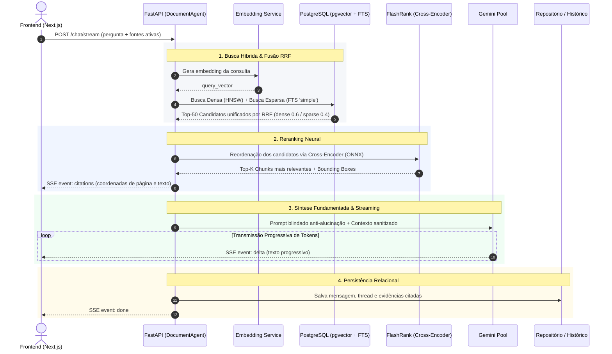

# 📄 Document AI Platform — Plataforma Inteligente de Análise Documental

> **Document AI Platform** é um workspace completo de pesquisa e análise documental inteligente inspirado no *Google NotebookLM*. Combina **FastAPI**, **Next.js**, **PostgreSQL 16 com pgvector**, **Busca Híbrida (Dense + Sparse via RRF)**, **Reranking Neural Cross-Encoder (FlashRank)**, **Streaming SSE** com marcação visual de coordenadas em PDF, editor de notas **Tiptap** e um subsistema real de **RAG Evaluation & Observabilidade** com métricas *LLM-as-a-Judge* (Faithfulness, Recall@5, MRR@5).

---

## 🌟 Principais Recursos & Diferenciais Técnicos

* **Bancada de Trabalho Tripartite (*NotebookLM Style*)**: Layout em 3 colunas dedicadas — Fontes em Custódia, Dossiê de Pesquisa/Chat em Tempo Real e Inspetor de Evidências/Studio de Notas.
* **Busca Híbrida com Fusão RRF (*Reciprocal Rank Fusion*)**: Combina recuperação densa vetorial (**pgvector** com distância cosseno) e recuperação esparsa lexical (**PostgreSQL Full-Text Search** via `plainto_tsquery` e `ts_rank_cd`), unificadas por ordenação ponderada RRF (`dense 0.6` / `sparse 0.4`).
* **Reranking Neural Cross-Encoder (FlashRank)**: Reordenação de alta precisão com modelo `ms-marco-TinyBERT-L-2-v2` executado localmente em CPU via ONNX Runtime (~5-10ms, ~15MB RAM), eliminando necessidade de GPU dedicada e maximizando a relevância dos trechos entregues ao LLM.
* **Extração Estruturada & Detecção de Tabelas (PyMuPDF)**: Parsing veloz em C via `fitz` com detecção nativa de tabelas (`find_tables()`), conversão de dados tabulares para Markdown, cálculo de *Bounding Boxes* normalizadas (`[x0, y0, x1, y1]`) e fallback seguro para `pypdfium2`.
* **Inspetor Visual de Evidências com Overlay em PDF**: Componente interativo com navegação por páginas, zoom e projeção visual animada da caixa delimitadora (*bounding box*) sobre o trecho exato citado no documento original.
* **Streaming SSE em Tempo Real**: Transmissão progressiva de tokens via *Server-Sent Events* (`POST /chat/stream`), emissão atômica de eventos de ciclo de vida (`citations` $\rightarrow$ `delta` $\rightarrow$ `done`) e renderização com cursor animado.
* **Fila de Ingestão Assíncrona Local (`IngestionQueue`)**: Pipeline desacoplado em memória (`asyncio.Queue` + `asyncio.Semaphore(2)`), com streaming de progresso em tempo real via SSE (`GET /documents/{id}/progress`) sem necessidade de dependências pesadas (Redis/Celery).
* **Studio de Notas & Sínteses com Tiptap WYSIWYG**: Editor de texto rico integrado, permitindo compilar conclusões, editar notas de pesquisa e injetar respostas do chat diretamente nas notas do caderno.
* **Pool Resiliente Multi-Modelo**: Alternância automática entre modelos do Google Gemini (`gemini-3.7-flash`, `gemini-3.5-flash`, `gemini-3.6-flash`, etc.), eliminando indisponibilidade por esgotamento de cota (*429 RESOURCE_EXHAUSTED*).
* **RAG Evaluation & Observabilidade Real**: Dashboard com métricas quantitativas calculadas sobre execuções reais (**Recall@5**, **MRR@5**, **Faithfulness**, **Answer Relevancy**, percentis de latência **P50/P95/P99** e **Quality Gates** com suporte a abstenção).
* **Segurança em Camadas & Isolamento Multi-tenant**: Isolamento estrito de dados por usuário na camada de aplicação e repositórios (`WHERE owner_id = :current_user_id`), proteção contra injeção indireta de prompt com higienização de delimitadores e sanitização contra *Path Traversal*.

---

## 🚀 Stack Tecnológica

| Camada | Tecnologias Principais |
| :--- | :--- |
| **Backend** | Python 3.13, FastAPI, Uvicorn, SQLAlchemy 2.0, Pydantic v2 |
| **Banco de Dados & Busca** | PostgreSQL 16, pgvector (HNSW), PostgreSQL Full-Text Search (GIN), FlashRank (Cross-Encoder ONNX) |
| **IA & Embeddings** | Google GenAI SDK (Gemini 3.7/3.5 Flash), Ollama (Nomic-Embed-Text local), PyMuPDF (`fitz`), pypdfium2 |
| **Frontend** | Next.js 16 (App Router), React 19, TypeScript, Tailwind CSS v4 (Tema Editorial Light & Emerald) |
| **Componentes de UI** | Tiptap WYSIWYG, TanStack React Query v5, Zustand, Lucide React, Sonner |
| **Infra & DevOps** | Docker, Docker Compose, Pytest, Pytest-asyncio |

---

## 🏛️ Arquitetura e Fluxo de Dados (RAG Pipeline)

O diagrama abaixo ilustra o fluxo completo de uma requisição de chat com streaming SSE, desde a consulta do usuário até a fusão RRF, reranking neural e marcação visual de evidências:



---

## 📊 RAG Evaluation & Observabilidade (Baseline v1.2)

A plataforma possui um subsistema nativo de benchmarking offline e observabilidade contínua com **zero números simulados**, validando o pipeline contra datasets canônicos de ground truth:

```
================================================================================
MÉTRICA                         BASELINE v1.2 (Produção)   QUALITY GATE EXIGIDO
================================================================================
Recall@5                        100.0%                     ≥ 90.0%  (Pass)
MRR@5                           1.000                      ≥ 0.850  (Pass)
Faithfulness (Fidelidade)       100.0%                     ≥ 90.0%  (Pass)
Answer Relevancy (Relevância)   100.0%                     ≥ 95.0%  (Pass)
Success Rate (Confiabilidade)   100.0%                     ≥ 95.0%  (Pass)
P50 Latency                     0.78s                      < 3.00s  (Pass)
P95 Latency                     4.12s                      < 8.00s  (Pass)
STATUS GERAL DA HOMOLOGAÇÃO     ✅ APROVADO NA HOMOLOGAÇÃO (5/5 Critérios)
================================================================================
```

* **Datasets Canônicos Versionados**: `contracts_eval_v1.json` (6 casos focados em cláusulas contratuais) e `contracts_eval_v2.json` (12 casos expandidos com perguntas multifacetadas e testes adversariais).
* **Tratamento de Abstenção (`Negative Testing`)**: Quando submetido a perguntas fora de escopo, o sistema recusa com precisão, recebendo pontuação máxima em fidelidade por não alucinar.
* **Métricas de Precisão**: Cronometragem em alta fidelidade via `time.perf_counter()` para isolar tempo de retrieval, rerank e geração de tokens.

---

## 📂 Estrutura do Projeto

```bash
document-ai-platform/
├── backend/app/
│   ├── agents/           # Orquestrador RAG (DocumentAgent) e context builder
│   ├── api/              # Rotas REST (/auth, /notebooks, /documents, /chat, /evaluation)
│   ├── core/             # Configurações Pydantic, segurança JWT/Argon2id e fila assíncrona
│   ├── database/         # Modelos SQLAlchemy, conexão e migrações automáticas
│   ├── evaluation/       # Runner de benchmark, juízes LLM, métricas e datasets canônicos
│   ├── repositories/     # Acesso a dados, busca híbrida RRF e isolamento multi-tenant
│   ├── schemas/          # DTOs Pydantic de entrada e saída tipados
│   ├── services/         # Serviços (IA, Embeddings, Ingestão, Parsing PyMuPDF, Rerank FlashRank)
│   └── tests/            # Suíte completa de testes automatizados via Pytest
├── frontend/src/
│   ├── app/              # Rotas Next.js App Router (Auth, Workspace de Cadernos, Evaluation)
│   ├── features/         # Componentes do Workspace (Fontes, Chat SSE, Studio Tiptap, PDF Highlighter)
│   ├── hooks/            # Custom hooks React (useDocumentProgress via SSE)
│   ├── stores/           # Gerenciamento de estado Zustand (Chat, Notebook, Auth)
│   └── types/            # Tipos e contratos TypeScript da API
├── docker-compose.yml    # Orquestração de containers (FastAPI, PostgreSQL pgvector, Ollama)
└── pytest.ini            # Configuração da suíte de testes
```

---

## ⚙️ Instalação e Execução Rápida

### 1. Configurar Variáveis de Ambiente
Copie o arquivo de exemplo para `.env` na raiz:

```bash
cp .env.example .env
```

Defina sua chave da API do Google AI Studio no `.env`:
```env
GOOGLE_API_KEY=sua_chave_do_google_ai_studio_aqui
GEMINI_MODEL=gemini-3.7-flash
EMBEDDING_PROVIDER=ollama   # "ollama" ou "gemini"
```

### 2. Iniciar o Backend & Banco de Dados via Docker
```bash
docker compose up -d --build
```
* **Swagger UI (Documentação Interativa)**: `http://localhost:8000/docs`
* **Redoc**: `http://localhost:8000/redoc`

### 3. Iniciar a Aplicação Frontend
Em outro terminal:
```bash
cd frontend
npm install
npm run dev
```
* **Workspace da Plataforma**: `http://localhost:3000`
* **Dashboard de Avaliação & Métricas**: `http://localhost:3000/evaluation`

---

## 🧪 Execução de Testes e Benchmarks

```bash
# 1. Executar todos os testes automatizados do backend
pytest backend/app/tests/

# 2. Executar testes específicos de busca híbrida e isolamento de dados
pytest backend/app/tests/test_search.py backend/app/tests/test_rerank_service.py backend/app/tests/test_rls.py

# 3. Executar o benchmark oficial de avaliação RAG via CLI (Baseline v1.2)
python -m app.evaluation.runner --dataset backend/app/evaluation/datasets/contracts_eval_v1.json --name "Baseline v1.2" --baseline --top_k 5
```

---

## 🔒 Segurança e Confiabilidade

* **Isolamento de Dados Multi-tenant**: Filtragem mandatória em nível de repositório (`WHERE owner_id = :user_id`), impedindo acesso transversal entre usuários.
* **Proteção contra *Prompt Injection* Indireto**: Sanitização de caracteres invisíveis e de controle, escape de delimitadores de instrução (`[INST]`, `<<SYS>>`) e isolamento em tags `<document_evidence>`.
* **Criptografia de Senhas**: Hash padrão-ouro **Argon2id** recomendado pela OWASP.
* **Sanitização de Arquivos**: Armazenamento com UUIDs randômicos contra ataques de *Path Traversal*.