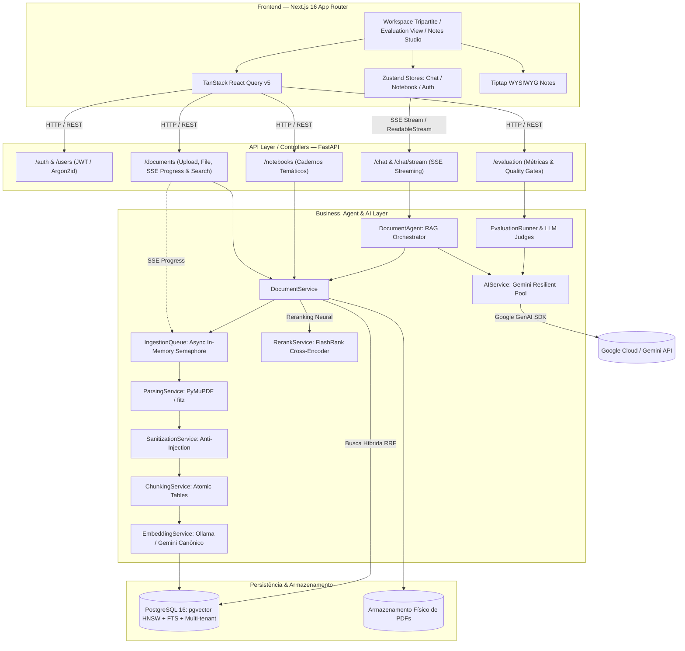
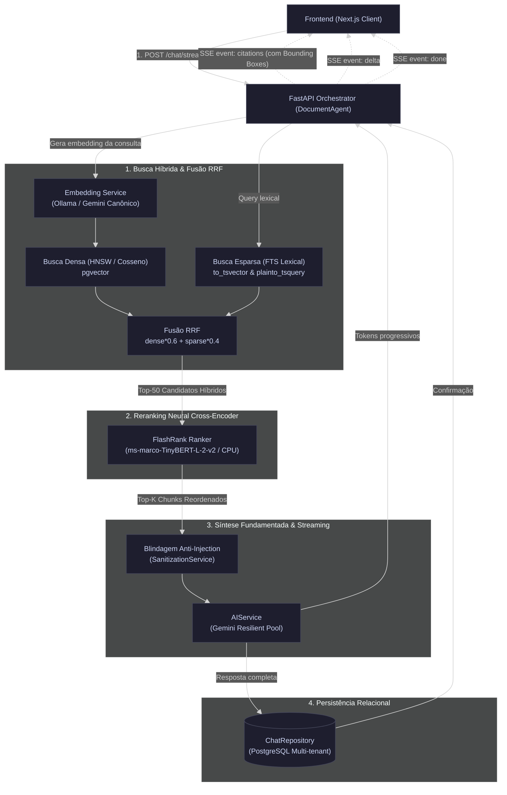

# 📄 Document AI Platform — Plataforma Inteligente de Análise Documental

Uma plataforma completa, moderna e escalável de **IA Documental e RAG (*Retrieval-Augmented Generation*)**, inspirada no Google NotebookLM. Integra **Next.js 16**, **FastAPI**, **PostgreSQL 16 + pgvector (Índice HNSW) + Busca Híbrida RRF**, **Reranking Cross-Encoder (FlashRank)**, **Extração Estruturada com PyMuPDF**, um pool resiliente de **Google Gemini** para gestão de cadernos temáticos, chat conversacional em tempo real via **Streaming SSE** e um subsistema real de **RAG Evaluation & Observabilidade**.

---

## 🌟 Principais Recursos & Diferenciais Técnicos

* **Bancada de Trabalho Tripartite (NotebookLM Style)**: Layout em 3 colunas dedicadas — Fontes em Custódia, Dossiê de Pesquisa/Chat em Tempo Real e Inspetor de Evidências/Studio de Notas.
* **Busca Híbrida com Fusão RRF (*Reciprocal Rank Fusion*)**: Combina recuperação densa vetorial (**pgvector** com distância cosseno) e recuperação esparsa lexical (**PostgreSQL Full-Text Search** via `plainto_tsquery` e `ts_rank_cd`), unificadas por ordenação ponderada RRF (`dense 0.6` / `sparse 0.4`).
* **Reranking Neural Cross-Encoder (FlashRank)**: Reordenação de alta precisão com modelo `ms-marco-TinyBERT-L-2-v2` executado localmente em CPU via ONNX Runtime (~5-10ms, ~15MB RAM), eliminando necessidade de GPU dedicada e maximizando a relevância dos trechos entregues ao LLM.
* **Extração Estruturada & Detecção de Tabelas (PyMuPDF)**: Parsing veloz em C via `fitz` com detecção nativa de tabelas (`find_tables()`), conversão atômica de dados tabulares para Markdown, cálculo de *Bounding Boxes* normalizadas (`[x0, y0, x1, y1]`) e fallback seguro para `pypdfium2`.
* **Inspetor Visual de Evidências com Overlay em PDF**: Componente interativo com navegação por páginas, zoom, tela cheia e projeção visual animada da caixa delimitadora (*bounding box*) sobre o trecho exato citado no documento original.
* **Streaming SSE em Tempo Real**: Transmissão progressiva de tokens via *Server-Sent Events* (`POST /chat/stream`), emissão atômica de eventos de ciclo de vida (`citations` $\rightarrow$ `delta` $\rightarrow$ `done`) e renderização com cursor animado (`▍`).
* **Fila de Ingestão Assíncrona Local (`IngestionQueue`)**: Pipeline 100% desacoplado em memória (`asyncio.Queue` + `asyncio.Semaphore(2)`), com streaming de progresso em tempo real via SSE (`GET /documents/{id}/progress`) sem necessidade de dependências externas pesadas (como Redis ou Celery).
* **Studio de Notas & Sínteses com Tiptap WYSIWYG**: Editor de texto rico integrado, permitindo aos analistas compilar conclusões, editar notas de pesquisa e injetar respostas do chat com formatação rica diretamente nas notas do caderno.
* **Persistência Relacional de Conversas**: Modelagem relacional no PostgreSQL (`chat_threads` e `chat_messages`) com isolamento estrito de histórico por caderno e restauração instantânea pós-recarregamento (**F5**).
* **Pool Resiliente Multi-Modelo**: Alternância automática e transparente entre modelos do Google Gemini (`gemini-3.5-flash`, `gemini-3.5-flash-lite`, `gemini-3.7-flash`, `gemini-3.6-flash`), eliminando indisponibilidade por esgotamento de cota (*429 RESOURCE_EXHAUSTED*) ou sobrecarga temporária (*503 UNAVAILABLE*).
* **Catálogo Universal de Tarefas Analíticas**: 6 presets prontos de síntese documental para qualquer domínio (Resumo Executivo, Guia de Estudos & FAQ, Extração de Dados & Tabelas, Linha do Tempo / Fases, Pontos Críticos & Riscos e Briefing em Tópicos).
* **RAG Evaluation & Observabilidade Real**: Dashboard com métricas quantitativas calculadas sobre execuções reais (**Recall@5**, **MRR@5**, **Faithfulness** e **Answer Relevancy** via LLM-as-a-Judge, percentis de latência **P50/P95/P99** e **5 Quality Gates de Produção** com suporte a abstenção/negative testing).
* **Segurança em Camadas & Isolamento Multi-tenant**: Isolamento estrito de dados por usuário na camada de aplicação e repositórios (`WHERE owner_id = :current_user_id`), proteção contra injeção indireta de prompt com higienização determinística de caracteres invisíveis/tokens de instrução e sanitização contra *Path Traversal*.

---

## 🚀 Stack Tecnológica Completa

### Backend & Inteligência Artificial
- **Framework Web**: [FastAPI](https://fastapi.tiangolo.com/) (Python 3.13, assíncrono e tipado com Pydantic v2)
- **Servidor ASGI**: [Uvicorn](https://www.uvicorn.org/) de alto desempenho
- **Modelos Generativos**: [Google Gemini](https://ai.google.dev/) via SDK oficial `google-genai` com pool multi-modelo resiliente (`gemini-3.7-flash`, `gemini-3.5-flash`, etc.)
- **Reranker Cross-Encoder**: [FlashRank](https://github.com/PrithivirajDamodaran/FlashRank) executando `ms-marco-TinyBERT-L-2-v2` sobre ONNX Runtime (CPU ultra-leve)
- **Banco de Dados & Vetores**: [PostgreSQL 16](https://www.postgresql.org/) + [pgvector](https://github.com/pgvector/pgvector) com índice **HNSW** (`vector_cosine_ops`, 768 dimensões)
- **Busca Híbrida & FTS**: PostgreSQL Full-Text Search (`ts_rank_cd`, `plainto_tsquery`) + extensão `pg_trgm` com índice **GIN Trigram** e fusão por **Reciprocal Rank Fusion (RRF)**
- **Isolamento de Dados Multi-tenant**: Isolamento rigoroso por usuário nos serviços e repositórios (`WHERE owner_id = :current_user_id`), garantindo retenção estrita de dados por tenant
- **ORM Relacional**: [SQLAlchemy 2.0](https://www.sqlalchemy.org/) com mapeamento declarativo moderno (`Mapped`, `mapped_column`)
- **Embeddings Canônicos Configuráveis**: Provedor único por configuração (`EMBEDDING_PROVIDER`), garantindo homogeneidade estrita do espaço vetorial e eliminando contaminação latente:
  - Provedor Primário (Local): [Ollama](https://ollama.com/) executando `nomic-embed-text` (768d) via `llama-index-embeddings-ollama`
  - Provedor em Nuvem: [Google Gemini](https://ai.google.dev/) Embeddings (`gemini-embedding-001`, 768d) via `google-genai`
- **Extração Estruturada de Documentos**:
  - Extrator Primário: [PyMuPDF (fitz)](https://pymupdf.readthedocs.io/) com detecção de tabelas (`find_tables()`), exportação Markdown e *bounding boxes* espaciais
  - Fallback: [pypdfium2](https://pypdfium2.readthedocs.io/) para leitura rápida por página
- **Fila Assíncrona & Concorrência**: `asyncio.Queue` + `asyncio.Semaphore(2)` in-process com streaming SSE de progresso
- **Higienização & Defesa**: `SanitizationService` (remoção de caracteres de controle/zero-width, escape de tokens de instrução de LLM e encapsulamento em tags `<document_evidence>`)
- **Segurança & Criptografia**: [pwdlib](https://pwdlib.readthedocs.io/) + [Argon2id](https://en.wikipedia.org/wiki/Argon2) (OWASP standard) e [PyJWT](https://pyjwt.readthedocs.io/) (Tokens Bearer)
- **Cliente HTTP & Pooling**: [HTTPX](https://www.python-httpx.org/) com `HTTPTransport`, retries e connection limits customizados
- **Testes & Telemetria**: [Pytest](https://docs.pytest.org/) e `pytest-asyncio` com suíte de 54 testes unitários e de integração (23 módulos de teste)

### Frontend & Interface
- **Framework & Runtime**: [Next.js 16](https://nextjs.org/) (App Router, Turbopack, React 19)
- **Linguagem**: [TypeScript](https://www.typescriptlang.org/) com tipagem estrita de ponta a ponta
- **Estilização & Design System**: [Tailwind CSS v4](https://tailwindcss.com/) com design system claro e moderno *Light & Friendly Green* (fundos arejados `#F8FAFC`, texto slate `#1E293B`, bordas sutis e destaques em verde esmeralda `#059669` / `#ECFDF5`)
- **Utilitários CSS**: `clsx` e `tailwind-merge` via helper `cn()`
- **Editor Rich Text (Studio de Notas)**: [Tiptap](https://tiptap.dev/) (`@tiptap/react`, `@tiptap/starter-kit`, `@tiptap/extension-placeholder`)
- **Gerenciamento de Estado Global**: [Zustand](https://zustand-demo.pmnd.rs/) com stores modulares:
  - `useChatStore`: Isolamento de threads, mensagens, citações e notas por caderno
  - `useNotebookStore`: Seleção de caderno ativo e gestão de fontes vinculadas
  - `useAuthStore`: Estado de sessão, usuário logado e persistência de token JWT
- **Data Fetching & Cache**: [TanStack React Query v5](https://tanstack.com/query/latest)
- **Validação de Formulários**: [React Hook Form](https://react-hook-form.com/) integrado a [Zod](https://zod.dev/) via `@hookform/resolvers/zod`
- **Cliente HTTP**: [Axios](https://axios-http.com/) com interceptors para injeção automática de Bearer JWT, captura de 401 e parser de erros do Pydantic v2
- **Renderização Markdown**: `react-markdown` com suporte a tabelas e sintaxe estendida via `remark-gfm`
- **Inspetor de PDF**: Componente nativo `PDFHighlighter` com zoom, paginação e overlay de *bounding boxes*
- **Ícones & Notificações**: [Lucide React](https://lucide.dev/) e [Sonner](https://sonner.emilkowal.ski/)

---

## 🏛️ Arquitetura do Sistema

O sistema aplica rigorosamente o padrão **Clean Architecture** em camadas desacopladas com recuperação híbrida e reranking:

$$\text{Client (Next.js 16)} \longleftrightarrow \text{API Layer (FastAPI)} \longleftrightarrow \text{Agents & Services} \longleftrightarrow \text{Hybrid Retrieval & Rerank} \longleftrightarrow \text{Database (PostgreSQL + pgvector)}$$



---

## 💬 Pipeline de Recuperação Híbrida & Streaming SSE (`/chat/stream`)

### Fluxograma de Orquestração com RRF e Reranking



### Diagrama de Sequência Detalhado

```mermaid
%%{init: {'theme': 'dark', 'themeVariables': { 'fontSize': '12px', 'darkMode': true }}}%%
sequenceDiagram
    autonumber
    actor User as Frontend (Next.js)
    participant API as FastAPI (DocumentAgent)
    participant Emb as Embedding (Ollama/Gemini)
    participant DB as PostgreSQL (pgvector + FTS)
    participant RR as FlashRank (Cross-Encoder)
    participant LLM as Gemini Pool
    participant PG as Chat Repository (PostgreSQL)

    User->>API: POST /chat/stream
    
    rect rgb(30, 35, 45)
        Note over API,DB: 1. Recuperação Híbrida & RRF
        API->>Emb: Gera embedding da query
        Emb-->>API: query_vector
        API->>DB: Busca Densa (HNSW) + Busca Esparsa (FTS)
        DB-->>API: Candidatos combinados por RRF
    end

    rect rgb(35, 35, 50)
        Note over API,RR: 2. Reranking Neural
        API->>RR: Rerank dos candidatos (Cross-Encoder)
        RR-->>API: Top-K Chunks com score e Bounding Boxes
        API-->>User: SSE event: citations
    end

    rect rgb(35, 40, 35)
        Note over API,LLM: 3. Síntese e Streaming
        API->>LLM: Prompt Anti-Alucinação + Contexto Sanitizado
        loop Stream de Tokens
            LLM-->>User: SSE event: delta
        end
    end

    rect rgb(40, 35, 35)
        Note over API,PG: 4. Persistência Relacional
        API->>PG: Persiste mensagens, thread e evidências (Multi-tenant)
        PG-->>API: Confirmação
        API-->>User: SSE event: done
    end
```



---

## 📊 RAG Evaluation & Observabilidade (Baseline v1.2)

A plataforma possui um subsistema nativo de benchmarking offline e observabilidade com **zero números simulados**, validando o pipeline contra um dataset canônico de ground truth:

```
================================================================================
MÉTRICA                         BASELINE v1.2 (Produção)   QUALITY GATE EXIGIDO
================================================================================
Recall@5                        100.0%                     ≥ 90.0%  (Pass)
MRR@5                           1.000                      ≥ 0.850  (Pass)
Faithfulness (Fidelidade)       100.0%                     ≥ 90.0%  (Pass)
Answer Relevancy (Relevância)   100.0%                     ≥ 95.0%  (Pass)
Success Rate (Confiabilidade)   100.0%                     ≥ 95.0%  (Pass)
P50 Latency                     0.78s                      < 3.00s  (Pass)
P95 Latency                     4.12s                      < 8.00s  (Pass)
STATUS GERAL DA HOMOLOGAÇÃO     ✅ APROVADO NA HOMOLOGAÇÃO (5/5 Critérios)
================================================================================
```

### Destaques do Sistema de Avaliação:
1. **Datasets Canônicos Versionados**:
   - `contracts_eval_v1.json`: 6 casos de teste com queries focadas em cláusulas críticas e validação de abstenção homologada como Baseline oficial.
   - `contracts_eval_v2.json`: 12 casos de teste expandidos com maior complexidade analítica, abstenção adversarial (`eval-006`), perguntas multifacetadas e stress testing do reranker.
2. **Tratamento de Abstenção em Casos Fora de Escopo (`eval-006`)**: Se o usuário fizer uma pergunta adversarial ou fora do contexto dos documentos e o modelo recusar corretamente, o juiz atribui **100% de fidelidade e relevância**, em vez de penalizar o modelo.
3. **Warm-up Automático**: Elimina anomalias de *Cold Start* aquecendo as conexões TLS e o pooling de modelos antes de iniciar a contagem estatística.
4. **Cronometragem de Alta Precisão**: Utilização de `time.perf_counter()` para mensurar frações exatas de milissegundos na busca híbrida, no reranking e na geração do LLM.

---

## 📂 Estrutura de Diretórios Real

```bash
document-ai-platform/
├── backend/
│   └── app/
│       ├── main.py                     # Bootstrap FastAPI, Lifespan, Migrações e Rotas
│       ├── agents/
│       │   └── document_agent.py       # Orquestrador RAG, Context Builder e Gerador SSE
│       ├── api/
│       │   ├── routes_auth.py          # Autenticação, Login OAuth2 e JWT
│       │   ├── routes_users.py         # Cadastro e perfil de usuários
│       │   ├── routes_notebooks.py     # Gestão completa de Cadernos Temáticos (CRUD)
│       │   ├── routes_documents.py     # Upload, SSE Progress, Download de PDF e Busca Híbrida
│       │   ├── routes_chat.py          # Endpoints de Chat (Síncrono e Streaming SSE)
│       │   └── routes_evaluation.py    # API de Observabilidade e Execução de Benchmarks
│       ├── core/
│       │   ├── config.py               # Configurações Pydantic Settings
│       │   ├── security.py             # Hash Argon2id e Assinatura de Tokens JWT
│       │   └── ingestion_queue.py      # Fila de ingestão assíncrona local (Queue + Semaphore)
│       ├── database/
│       │   ├── base.py                 # Declarative Base SQLAlchemy
│       │   ├── connection.py           # Engine e SessionLocal PostgreSQL
│       │   ├── dependencies.py         # Injeção de dependências (get_db, repositories, services)
│       │   ├── rls.py                  # Camada/documentação de isolamento multi-tenant
│       │   └── models/                 # Entidades User, Notebook, Document, DocumentChunk,
│       │                               # ChatThread e ChatMessage
│       ├── evaluation/
│       │   ├── datasets/               # Datasets canônicos de Ground Truth (contracts_eval_v1/v2.json)
│       │   ├── judges.py               # Juízes LLM (Faithfulness e Answer Relevancy)
│       │   ├── metrics.py              # Cálculos estatísticos de Recall@K, MRR@K e Percentis
│       │   ├── runner.py               # Runner oficial de benchmark via CLI/API
│       │   ├── schemas.py              # Schemas Pydantic de traces e runs
│       │   └── storage.py              # Persistência de traces de avaliação em disco
│       ├── repositories/               # Repositórios (DocumentRepository, ChatRepository, NotebookRepository, UserRepository)
│       │                               # incluindo busca híbrida RRF e isolamento por tenant
│       ├── schemas/                    # DTOs Pydantic de validação de I/O
│       ├── services/                   # Serviços de negócio especializados:
│       │   ├── ai_service.py           # Pool resiliente multi-modelo Gemini com HTTPX
│       │   ├── chunking_service.py     # Particionamento hierárquico com tabelas atômicas
│       │   ├── document_service.py     # Orquestração do ciclo de vida documental
│       │   ├── embedding_service.py    # Batching com provedor canônico (Ollama / Gemini)
│       │   ├── notebook_service.py     # Regras de negócio de cadernos temáticos
│       │   ├── parsing_service.py      # Extração estruturada PyMuPDF/fitz e fallback pypdfium2
│       │   ├── rerank_service.py       # Reordenação neural ultra-rápida via FlashRank
│       │   ├── sanitization_service.py # Blindagem contra Prompt Injection e sanitização de texto
│       │   ├── storage_service.py      # Gestão de arquivos físicos de PDFs
│       │   └── user_service.py         # Criação e gestão de usuários
│       └── tests/                      # Suíte completa de 23 módulos de testes (54 testes via Pytest)
│
├── frontend/
│   ├── src/
│   │   ├── app/
│   │   │   ├── (auth)/                 # Rotas de Autenticação (/login, /register)
│   │   │   ├── (dashboard)/            # Rotas Protegidas:
│   │   │   │   ├── notebook/[id]/      # Bancada Tripartite completa do Caderno
│   │   │   │   ├── evaluation/         # Dashboard de Métricas, Benchmarks e Quality Gates
│   │   │   │   ├── documents/          # Gestão e visualização de acervo documental
│   │   │   │   └── chat/               # Visualização direta de conversação
│   │   │   ├── globals.css             # Configuração Tailwind CSS v4 e Design System Light
│   │   │   └── layout.tsx              # Root Layout com Providers e Sonner Toaster
│   │   ├── components/                 # Componentes compartilhados e UI base (Navbar, NotebookHeader)
│   │   ├── features/
│   │   │   ├── notebook/               # Workspace Tripartite:
│   │   │   │   ├── workspace.tsx       # Layout em 3 colunas (Fontes, Chat, Studio)
│   │   │   │   ├── chat-panel.tsx      # Chat interativo com streaming SSE e citações
│   │   │   │   ├── sources-panel.tsx   # Gestão de fontes em custódia e seleção ativa
│   │   │   │   ├── studio-panel.tsx    # Painel direito com abas de Notas, Evidências e Presets
│   │   │   │   ├── notes-editor.tsx    # Editor de texto rico (WYSIWYG Tiptap)
│   │   │   │   ├── pdf-highlighter.tsx # Visualizador de PDF com overlay de Bounding Boxes
│   │   │   │   ├── quick-tasks.tsx     # 6 Presets de tarefas analíticas rápidas
│   │   │   │   └── add-source-modal.tsx# Modal de upload de PDF com dropzone
│   │   │   ├── evaluation/             # Dashboard de Métricas, Quality Gates e Traces
│   │   │   └── home/                   # Home Dashboard, Gestão de Cadernos e Cards
│   │   ├── hooks/                      # Custom hooks React:
│   │   │   └── useDocumentProgress.ts  # Telemetria SSE de ingestão de documentos
│   │   ├── lib/
│   │   │   ├── api-client.ts           # Cliente Axios com interceptors JWT e tratamento de erros
│   │   │   └── utils.ts                # Utilitário cn() com clsx e tailwind-merge
│   │   ├── stores/                     # Stores modulares Zustand:
│   │   │   ├── useChatStore.ts         # Mensagens, threads, notas e citações ativas
│   │   │   ├── useNotebookStore.ts     # Caderno ativo e fontes vinculadas
│   │   │   └── useAuthStore.ts         # Usuário autenticado e token de acesso
│   │   └── types/                      # Interfaces TypeScript estritas da API
│   ├── package.json                    # Next.js 16, React 19, Tailwind v4, Tiptap, Axios, Zustand
│   └── tsconfig.json
│
├── DESIGN.md                           # Especificação oficial do Design System (Light & Friendly Green)
├── PRODUCT.md                          # Definição de escopo, personas e princípios de produto
├── dockerfile                          # Imagem Python 3.13-slim otimizada para backend
├── docker-compose.yml                  # Orquestração completa (API, PostgreSQL pgvector, Ollama)
├── docker-compose.test.yml             # Ambiente isolado para execução de testes
├── pytest.ini                          # Configurações do Pytest e pytest-asyncio
├── requirements.txt                    # Dependências do backend (FastAPI, pgvector, FlashRank, etc.)
└── readme.md                           # Documentação Técnica Oficial
```

---

## 📡 Catálogo Completo de Endpoints da API

| Método | Rota | Descrição | Autenticação |
| :--- | :--- | :--- | :---: |
| `GET` | `/` | Healthcheck e mensagem de boas-vindas da API | Pública |
| `POST` | `/auth/login` | Autentica usuário via OAuth2 Form e emite Bearer Token JWT | Pública |
| `GET` | `/auth/me` | Retorna o perfil do usuário logado | Bearer JWT |
| `POST` | `/users/register` | Cadastra novo usuário com hash seguro Argon2id | Pública |
| `GET` | `/notebooks/` | Lista todos os cadernos temáticos do usuário | Bearer JWT |
| `POST` | `/notebooks/` | Cria um novo caderno de análise | Bearer JWT |
| `GET` | `/notebooks/{id}` | Recupera dados do caderno e documentos vinculados | Bearer JWT |
| `PUT` | `/notebooks/{id}` | Atualiza o título ou descrição do caderno | Bearer JWT |
| `DELETE` | `/notebooks/{id}` | Exclui um caderno e desvincula suas fontes em cascata | Bearer JWT |
| `GET` | `/notebooks/{id}/documents` | Lista exclusivamente os documentos vinculados ao caderno | Bearer JWT |
| `POST` | `/documents/upload` | Upload assíncrono de PDF para a fila de ingestão (`202 Accepted`) | Bearer JWT |
| `GET` | `/documents/{id}/progress` | **Streaming SSE do progresso de ingestão** (parsing $\rightarrow$ chunking $\rightarrow$ embedding $\rightarrow$ ready) | Bearer JWT |
| `GET` | `/documents/` | Lista todos os documentos em custódia do usuário | Bearer JWT |
| `GET` | `/documents/{id}` | Detalhes de um documento específico | Bearer JWT |
| `GET` | `/documents/{id}/file` | Retorna o arquivo binário original do PDF (usado pelo visualizador) | Bearer JWT |
| `DELETE` | `/documents/{id}` | Exclui um documento, seus chunks e arquivo físico do disco | Bearer JWT |
| `POST` | `/documents/search` | **Busca Híbrida** (pgvector HNSW + FTS + RRF) com Rerank FlashRank | Bearer JWT |
| `POST` | `/chat/stream` | **Chat RAG com Streaming SSE** em tempo real e citações estruturadas | Bearer JWT |
| `POST` | `/chat/` | Chat conversacional RAG síncrono sobre os documentos | Bearer JWT |
| `GET` | `/chat/threads` | Lista as conversas/threads persistidas de um caderno | Bearer JWT |
| `GET` | `/chat/threads/{id}/messages`| Recupera histórico completo de mensagens salvas de uma thread | Bearer JWT |
| `GET` | `/evaluation/runs` | Lista histórico completo de baterias de benchmark | Bearer JWT |
| `GET` | `/evaluation/runs/{id}` | Detalhes estatísticos, métricas e traces de uma execução | Bearer JWT |
| `GET` | `/evaluation/baseline` | Recupera a execução homologada como Baseline oficial | Bearer JWT |
| `POST` | `/evaluation/run` | Dispara nova bateria de testes de avaliação do RAG | Bearer JWT |

---

## ⚙️ Instalação e Execução Local

### 1. Configurar Variáveis de Ambiente
Copie o template `.env.example` para `.env` na raiz:

```bash
cp .env.example .env
```

Preencha as configurações e sua chave do Google AI Studio no `.env`:
```env
POSTGRES_USER=admin
POSTGRES_PASSWORD=admin
POSTGRES_DB=documents
POSTGRES_HOST=database
POSTGRES_PORT=5432
JWT_SECRET_KEY=sua_chave_secreta_jwt_longa_e_aleatoria
JWT_ALGORITHM=HS256
ACCESS_TOKEN_EXPIRE_MINUTES=30

# Provedor Canônico de Embeddings ("ollama" ou "gemini")
EMBEDDING_PROVIDER=ollama

# Configurações do Ollama (Local)
OLLAMA_BASE_URL=http://localhost:11434
OLLAMA_EMBED_MODEL=nomic-embed-text
OLLAMA_LLM_MODEL=qwen2.5:7b

# Google Gemini API
GOOGLE_API_KEY=sua_chave_do_google_ai_studio_aqui
GEMINI_MODEL=gemini-3.7-flash
```

### 2. Subir o Backend & Banco via Docker
```bash
docker compose up -d --build
```
- **Documentação Interativa Swagger (OpenAPI)**: `http://localhost:8000/docs`
- **Documentação Redoc**: `http://localhost:8000/redoc`

### 3. Subir o Frontend Next.js
Em outro terminal:
```bash
cd frontend
npm install
npm run dev
```
- **Interface da Plataforma**: `http://localhost:3001`
- **Dashboard de Avaliação & Métricas**: `http://localhost:3001/evaluation`

---

## 🧪 Execução de Testes Automatizados

```bash
# Executar toda a suíte de testes do backend (23 módulos de teste, 54 testes)
pytest backend/app/tests/

# Executar testes específicos de busca híbrida, reranking e isolamento
pytest backend/app/tests/test_search.py backend/app/tests/test_rerank_service.py backend/app/tests/test_rls.py

# Executar benchmark oficial de avaliação via CLI (Baseline v1.2)
python -m app.evaluation.runner --dataset backend/app/evaluation/datasets/contracts_eval_v1.json --name "Baseline v1.2" --baseline --top_k 5

# Executar benchmark expandido com casos complexos e abstenção (v2)
python -m app.evaluation.runner --dataset backend/app/evaluation/datasets/contracts_eval_v2.json --name "Benchmark Real v2.0" --top_k 5
```

---

## 🔒 Práticas de Segurança e Engenharia

- **Isolamento de Dados Multi-tenant em Camadas**: Filtragem estrita por identificador de usuário (`owner_id`) em nível de serviço e repositório (`WHERE owner_id = :current_user_id`), garantindo separação hermética entre contas sem vazamento de dados transversais.
- **Blindagem contra *Indirect Prompt Injection***: Higienização de caracteres invisíveis e de controle (`ZERO_WIDTH_AND_CONTROL_CHARS`), escape de delimitadores de sistema de LLM (`[INST]`, `<<SYS>>`, `<|im_start|>`) e encapsulamento em tags `<document_evidence>` passivas.
- **Argon2id Password Hashing**: Utilização do algoritmo padrão-ouro recomendado pela OWASP para proteção contra ataques de força bruta com GPU.
- **Evidence-First Retrieval com Bounding Boxes**: Cada resposta sintetizada pelo LLM vincula trechos literais auditáveis com indicação da página, pontuação de similaridade e coordenadas visuais de demarcação no PDF.
- **Sanitização contra Path Traversal**: Arquivos PDF em custódia recebem identificadores únicos UUIDv4 no sistema de arquivos, impedindo manipulação maliciosa de caminhos.
- **Prevenção de Cold Start & Rate Limit**: Warm-up de conexões SSL, pooling HTTPX reutilizável e chaveamento instantâneo em pool multi-modelo quando atingido o teto de cota da API.
- **Fila de Ingestão com Concorrência Controlada**: Uso de semáforos assíncronos (`asyncio.Semaphore(2)`) e execução em thread pool desacoplado (`run_in_executor`) para preservar o consumo de CPU e memória do servidor.