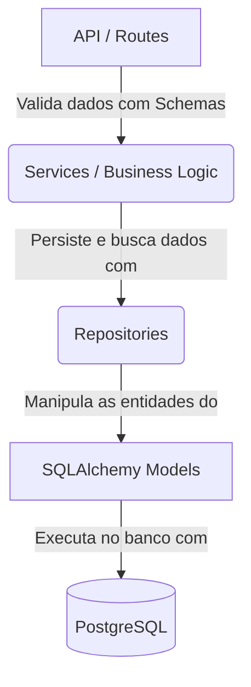

# 📄 Document AI Platform (Plataforma IA para Documentos)

Uma API robusta e moderna desenvolvida com **FastAPI** para gestão inteligente de documentos usando IA Generativa. Este projeto serve como um showcase de engenharia de software no meu portfólio, utilizando conceitos de arquitetura limpa, segurança moderna, injeção de dependências e testes automatizados.

---

## 🚀 Tecnologias Utilizadas

- **Web Framework**: [FastAPI](https://fastapi.tiangolo.com/) (Rápido, assíncrono e baseado em type hints)
- **Database ORM**: [SQLAlchemy 2.0](https://www.sqlalchemy.org/) (Tipagem estática moderna com `Mapped` e `mapped_column`)
- **Database**: [PostgreSQL 16](https://www.postgresql.org/) + [pgvector](https://github.com/pgvector/pgvector) (Para busca semântica de embeddings)
- **Security**: [pwdlib](https://pwdlib.readthedocs.io/) + [Argon2id](https://en.wikipedia.org/wiki/Argon2) (Algoritmo de criptografia de senhas recomendado pela OWASP)
- **Validation**: [Pydantic v2](https://docs.pydantic.dev/)
- **Containerization**: [Docker](https://www.docker.com/) & [Docker Compose](https://docs.docker.com/compose/)
- **Tests**: [Pytest](https://docs.pytest.org/) & [HTTPX](https://www.python-httpx.org/) (Para testes automatizados de integração)

---

## 🏛️ Arquitetura do Projeto

O backend está estruturado seguindo os princípios de **Clean Architecture** (Arquitetura Limpa) e **Separation of Concerns** (Separação de Responsabilidades):



### Estrutura de Diretórios e Arquivos

Abaixo está a descrição detalhada das responsabilidades de cada diretório e arquivo na estrutura atual:

```bash
backend/
├── app/
│   ├── main.py              # Porta de entrada da aplicação. Inicializa o FastAPI, define rotas principais e lifespan.
│   ├── agents/              # Agentes cognitivos (ex: LangGraph) para interação inteligente com documentos.
│   ├── api/                 # Camada de apresentação da API (End-points/Routers).
│   │   └── routes_users.py  # Endpoints de gerenciamento e cadastro de usuários.
│   ├── core/                # Configurações globais e utilitários de segurança.
│   │   ├── config.py        # Validação de variáveis de ambiente com Pydantic Settings.
│   │   └── security.py      # Lógica de hashing e validação de senhas com Argon2id.
│   ├── database/            # Configurações do Banco de Dados e Modelos ORM (SQLAlchemy).
│   │   ├── base.py          # Classe declarativa base para o mapeamento das tabelas.
│   │   ├── connection.py    # Configuração do engine e fábrica de conexões SessionLocal.
│   │   ├── dependencies.py  # Injetor de dependência get_db para gerenciar sessões do PostgreSQL.
│   │   └── models/          # Entidades físicas do banco de dados (ex: user.py).
│   ├── repositories/        # Camada de persistência (Padrão Repository).
│   │   └── user_repository.py # Encapsula operações de banco (SQL queries) para a tabela de usuários.
│   ├── schemas/             # Validação e serialização de dados de entrada/saída (Pydantic).
│   │   └── user_schema.py   # Schemas Pydantic para validação das requisições de usuário (UserCreate, UserResponse).
│   ├── services/            # Camada de regras de negócio (Business Logic).
│   │   └── user_service.py  # Gerencia a lógica de cadastro (valida e-mail duplicado, encripta senhas).
│   └── tests/               # Suíte de testes com Pytest.
│       ├── conftest.py      # Fixtures do Pytest para isolamento e ciclo de vida do banco de dados de teste.
│       ├── test_user_api.py # Testes de integração de endpoints de API.
│       ├── test_user_repository.py # Testes de integração diretos na camada Repository.
│       └── test_user_service.py # Testes unitários e de integração de regras de negócio na Service.
├── dockerfile               # Dockerfile otimizado para Python Slim.
└── pytest.ini               # Configurações do Pytest.
```

---

## ⚙️ Instalação e Execução

### Pré-requisitos
- Docker instalado na sua máquina.

### Executando a Aplicação
Para subir todo o ambiente de desenvolvimento (Banco de dados PostgreSQL + API FastAPI) rodando em segundo plano:

```bash
docker compose up -d --build
```

A API estará disponível em: [http://localhost:8000](http://localhost:8000)
A documentação interativa da API (Swagger UI) pode ser acessada em: [http://localhost:8000/docs](http://localhost:8000/docs)

---

## 🧪 Suíte de Testes Automatizados

O projeto utiliza um banco de dados PostgreSQL isolado dedicado apenas para testes, garantindo que a base de dados de desenvolvimento/produção nunca seja poluída ou corrompida.

### 1. Iniciar o Banco de Testes
```bash
docker compose -f docker-compose.test.yml up -d
```

### 2. Executar os Testes (Pytest)
Com o ambiente virtual ativado (`.venv`), execute:

```bash
pytest
```

---

## 🔒 Boas Práticas e Segurança Aplicadas

- **Gestão de Segredos**: Nenhuma chave ou credencial é exposta no código. Todas as configurações críticas são lidas a partir de arquivos `.env` validados estritamente via `pydantic-settings`.
- **Deduplicação de Código (DRY)**: As rotas compartilham injeções de dependência de ciclo de vida de banco de dados (`get_db`) localizadas centralizadamente.
- **Teardown e Isolamento de Testes**: As fixtures do Pytest criam tabelas limpas para cada teste e as destroem ao final (`drop_all`), impedindo poluição de estado entre os testes.
- **Hashing Criptográfico Robusto**: Senhas de usuários não são salvas no banco de dados; apenas seus hashes gerados usando o algoritmo **Argon2id** (com salt e fatores de custo dinâmicos).
