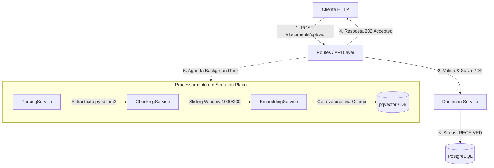

# 📄 Document AI Platform (Plataforma IA para Documentos)

Uma API robusta e moderna desenvolvida com **FastAPI** para gestão inteligente de documentos usando IA Generativa e busca vetorial. Este projeto serve como um showcase de engenharia de software no meu portfólio, aplicando conceitos de arquitetura em camadas, processamento assíncrono, injeção de dependências e testes automatizados.

---

## 🚀 Tecnologias Utilizadas

- **Web Framework**: [FastAPI](https://fastapi.tiangolo.com/) (Assíncrono, moderno e baseado em type hints)
- **Database & Vector Search**: [PostgreSQL 16](https://www.postgresql.org/) + [pgvector](https://github.com/pgvector/pgvector) (Para armazenamento e busca semântica de embeddings com dimensão 768)
- **Database ORM**: [SQLAlchemy 2.0](https://www.sqlalchemy.org/) (Tipagem estática moderna com `Mapped` e `mapped_column`)
- **AI & Embeddings**: [Ollama](https://ollama.com/) rodando o modelo `nomic-embed-text` via [LlamaIndex](https://www.llamaindex.ai/)
- **PDF Processing**: `pypdfium2` para extração rápida de texto
- **Security & Auth**: [pwdlib](https://pwdlib.readthedocs.io/) + [Argon2id](https://en.wikipedia.org/wiki/Argon2) (Hashing recomendado pela OWASP) e [PyJWT](https://pyjwt.readthedocs.io/) (Autenticação via Bearer Tokens)
- **Validation**: [Pydantic v2](https://docs.pydantic.dev/) & `pydantic-settings`
- **Containerization**: [Docker](https://www.docker.com/) & [Docker Compose](https://docs.docker.com/compose/)
- **Tests**: [Pytest](https://docs.pytest.org/) & [HTTPX](https://www.python-httpx.org/) (Para testes de integração)

---

## 🏛️ Arquitetura e Pipeline de Processamento

A aplicação adota uma arquitetura em camadas (**Routes $\rightarrow$ Services $\rightarrow$ Repositories $\rightarrow$ Models**), garantindo separação de responsabilidades e facilitando a manutenção.

### Pipeline Assíncrono de Ingestão de Documentos

Ao realizar o upload de um PDF, a API responde imediatamente com status `202 Accepted` e orquestra o processamento em segundo plano (`BackgroundTasks`):



---

## 📂 Estrutura de Diretórios

```bash
backend/
├── app/
│   ├── main.py              # Bootstrap da aplicação e extensão pgvector.
│   ├── api/                 # Camada de apresentação da API (Controllers/Routers).
│   │   ├── routes_auth.py   # Auth, Login e geração de JWT.
│   │   ├── routes_users.py  # Gestão e cadastro de usuários.
│   │   └── routes_documents.py # Upload e gestão de documentos.
│   ├── core/                # Configurações globais, segurança e JWT.
│   ├── database/            # Conexão, sessão e modelos ORM.
│   │   └── models/          # Entidades físicas (User, Document, DocumentChunk).
│   ├── repositories/        # Camada de persistência (UserRepository, DocumentRepository).
│   ├── schemas/             # Validação e DTOs (Pydantic v2).
│   ├── services/            # Camada de regras de negócio e serviços de IA.
│   │   ├── user_service.py      # Lógica de cadastro e validações de usuário.
│   │   ├── document_service.py  # Gestão de arquivos e metadados.
│   │   ├── parsing_service.py   # Extração de texto de PDFs.
│   │   ├── chunking_service.py  # Segmentação de texto em vetores.
│   │   └── embedding_service.py # Integração com Ollama para geração de embeddings.
│   └── tests/               # Suíte de testes automatizados com banco isolado.
├── dockerfile               # Imagem Python 3.13-slim otimizada.
├── docker-compose.yml       # Stack completa (API, PostgreSQL+pgvector, Ollama + init).
└── pytest.ini               # Configurações do Pytest.
```

---

## ⚙️ Execução e Infraestrutura

### Pré-requisitos
- **Docker** e **Docker Compose** instalados.

### Subindo o Ambiente Completo
O ambiente Docker já contempla a API, o banco PostgreSQL com `pgvector` e o serviço `Ollama` com o modelo de embeddings pré-carregado via *init-container*:

```bash
docker compose up -d --build
```

- **API Base URL**: `http://localhost:8000`
- **Documentação Swagger**: `http://localhost:8000/docs`
- **Ollama Engine**: `http://localhost:11434`

---

## 🧪 Testes Automatizados

O ambiente de testes roda com um banco PostgreSQL isolado em container dedicado, garantindo o isolamento da base de dados local/dev.

```bash
# 1. Subir o container exclusivo de testes
docker compose -f docker-compose.test.yml up -d

# 2. Executar a suíte com Pytest
pytest
```

---

## 🔒 Boas Práticas e Segurança

- **Hashing Avançado**: Uso de **Argon2id** com salt dinâmico para armazenamento seguro de credenciais.
- **Isolamento de Dados (Multi-tenancy)**: Verificação rigorosa de *ownership* em todas as rotas de documentos (usuários acessam apenas seus próprios arquivos).
- **Processamento Não-Bloqueante**: Utilização de `BackgroundTasks` para extração de texto e geração de embeddings sem travar o worker HTTP principal.
- **Persistência Vetorial**: Estruturação dos chunks de documentos em vetores de 768 dimensões com suporte nativo do `pgvector`.